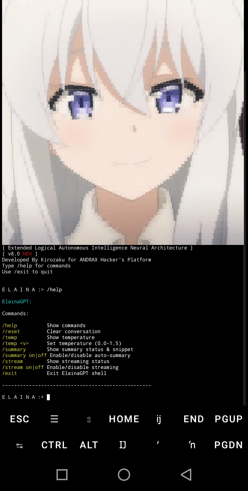

# ElainaGPT AI


**ElainaGPT AI** is designed to deliver powerful, unrestricted, and seamless AI-driven conversations—pushing the limits of what is possible with natural language processing.

These tools were created with the vision of assisting penetration testing workflows and providing an effective learning platform in the field of cybersecurity.  
As an open-source project, it welcomes development and contributions from the community.  
This tool is strictly for educational purposes only.

**Disclaimer:** Any use of **ElainaGPT AI** for illegal activities goes against its core purpose and principles. I am not responsible for any misuse or consequences resulting from unauthorized actions.


## ✨ Features

- **Powerful AI Conversations:** Intelligent, context-aware responses.
- **Unrestricted Framework:** System prompts designed to bypass common AI limitations.
- **Simple CLI Interface:** Clean and easy-to-use terminal interface.
- **Cross-Platform:** Works on Kali Linux, Ubuntu, and Termux.


# ⚡ Installation (Automatic)

# 📱 Android Installation (Termux/kali-nethunter/andrax-android)

## Install ElainaGPT

```bash
wget https://github.com/Kirozaku/ElainaGPT/raw/refs/heads/main/elaina-android
chmod +x elaina-android
```

Run:

```bash
./elaina-android
```


# 🖥️ Linux Installation (Kali-Linux/Ubuntu/Debian)

## Install ElainaGPT

```bash
wget https://github.com/Kirozaku/ElainaGPT/raw/refs/heads/main/elaina-linux
chmod +x elaina-linux
```

Run:

```bash
./elaina-linux
```


## 💻 Screenshot ElainaGPT

  



Created by **[Kirozaku](https://github.com/Kirozaku)**


## ₿ Donate with Bitcoin

My money is not enough to buy a laptop, every satoshi helps!

**Bitcoin Wallet Address: `1N1rMC95mwYqpQNCWC5TQmZJGdpwf2APsS`**
